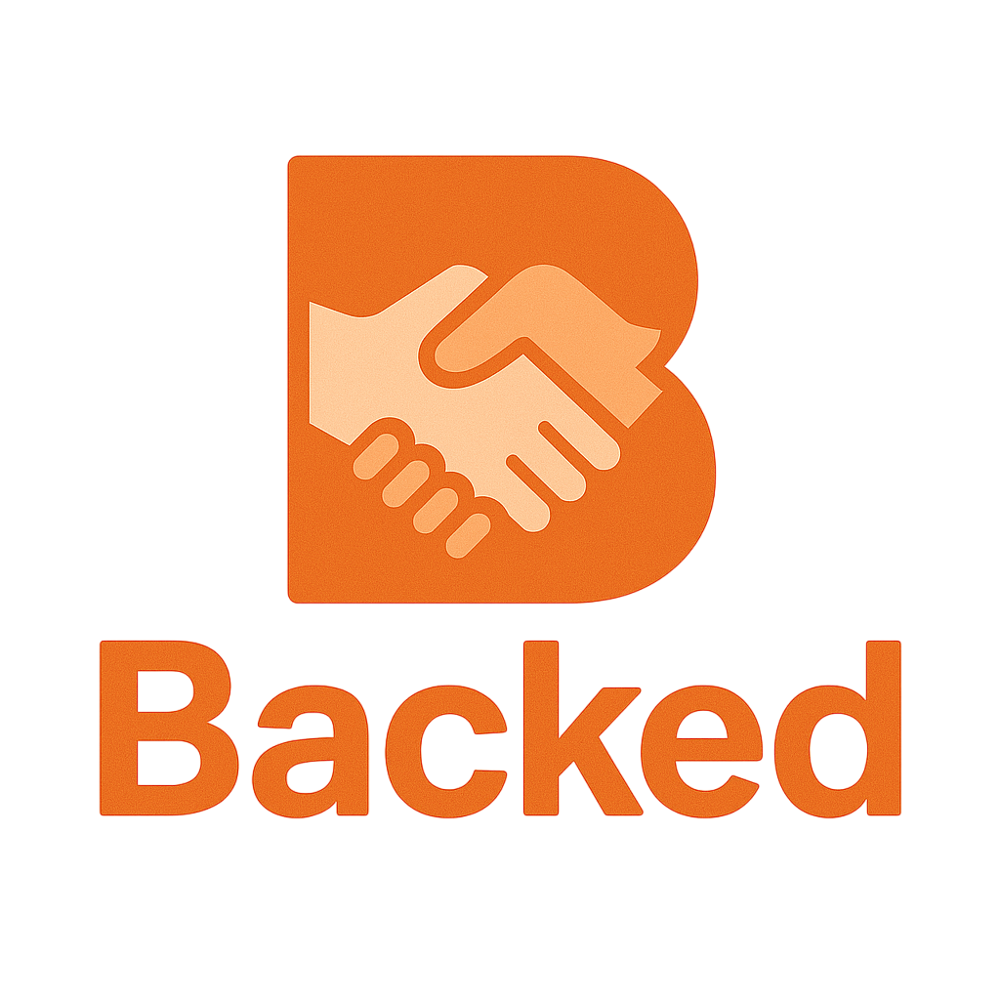

# 🚀 BACKED By Capital One — Invest In Your Community

Proud **1st place** winners at the **Capital One Tech Summit Hackathon (May 2025)**! 🎉

**BACKED** is a sleek, modern web app that connects **local investors** with **small businesses** in their own communities.

_"Change banking for good"_  
_"Bring ingenuity, simplicity, and humanity to banking"_  
_"Dare to dream, disrupt, and deliver a better way"_  
Built with ❤️ as part of the Capital One Tech Summit Hackathon, May 2025

**Empower your neighborhood. Fund the future. Get BACKED.**

---

## 🌍 Why BACKED?

In a world dominated by big corporations, **BACKED** flips the script—giving **back where it matters most: your *community***. Now, your partner owns shares in the neighbor's café down the block, another one of your neighbors is funding your daughter's startup dreams, and you yourself—you're backing the local bookstore. Everyone in your local community came together and is using BACKED: investing in people, not just products. With BACKED, investing becomes **accessible, personal, and deeply impactful.**

We built this with the vision of making a difference, and we’re proud to say we won **first place** at the **Capital One Tech Summit Hackathon (May 2025)**! 🎉

> 🔗 *Think Kickstarter meets Wall Street… but for your block.*

---

## ✨ Core Features

- 🎨 **Modern Design**: Clean and minimal UI, infused with Capital One's signature colors (#d32f2f & #004878)
- 📱 **Fully Responsive**: Optimized for mobile, tablet, and desktop
- 🌙 **Dark Mode Toggle**: For eyes that code (and invest) at night
- 🖱️ **Custom Cursor Magic**: Because details matter
- 📊 **Interactive Listings**: Dive into real investment opportunities from real local businesses
- 🙋 **User Accounts**: Create your profile, track your activity, stay engaged
- 🔄 **Animated UI**: Smooth scrolls, lively interactions, and motion that guides

---

## 📄 Key Pages

| Page | What You'll Find |
|------|------------------|
| **Homepage** | Welcome overview & featured businesses |
| **Featured Opportunities** | Explore businesses actively seeking investment |
| **About Us** | Our mission, vision, and who we are |
| **Sign Up/Login** | After secure account creation and access, look at your dashboard and investments |

---

## 🛠️ Built With

- **HTML5**  
- **CSS3** (custom properties, variables, and slick animations)  
- **Vanilla JavaScript** (lightweight and fast)  
- **Chart.js** for investment insights  
- **AOS (Animate On Scroll)** for immersive animations

---

## ⚙️ Getting Started

Ready to dive in? Here's how:

1. Head to the live MVP at [https://kekn1us5.live.codepad.app](https://kekn1us5.live.codepad.app)
2. Explore local business investment opportunities — no sign-up required for browsing!
3. Want to get involved? Create an account and start investing in your community.

It’s simple, quick, and fun to see how BACKED can transform your relationship with local businesses.

---

## 🖥️ Previous Demos

During our intense 36-hour hackathon in May 2025, we quickly iterated on **BACKED**, testing new features and refining the user experience with every version. Each demo showcases how our vision evolved, from initial concepts to the polished product we have today.

- **[Version 0 - First Concept](https://np5ar4bt.live.codepad.app)**: The early stages of **BACKED**, where we tested out basic ideas, but felt the app was still too "corporate" and lacked a personal touch.
- **[Version 0.1 - Design Foundations](https://c5er4491.live.codepad.app)**: We started to bring the design together here, adding smooth animations and visual elements that really made the app *pop* — bringing it closer to the look we wanted.
- **[Taking a Break - User Flow Experiment](https://5ly00wm0.live.codepad.app)**: This version focused on refining the user experience, specifically the signup/login flow. We got some inspiration from [this YouTube tutorial](https://www.youtube.com/watch?v=Z_AbWH-Vyl8), which helped make the process feel seamless.
- **[Version 1.0 - First Live Demo](https://kekn1us5.live.codepad.app/)**: Our first major milestone — this is where the app went live and was fully functional, featuring core features like browsing investments and user sign-ups.
- **[Version 1.1 - Coming Soon](#)**: We’re continuing to enhance **BACKED** with new features and improvements. Stay tuned for the next update!

---

## 🚧 What's Next?

Here’s where we’re headed:

- 🔐 **Backend Integration** for secure user authentication
- 🗺️ **Google Maps API Scraping** to gather and showcase local business data by zip code
- 💳 **Payment Processing & Wallet** functionality for seamless transactions
- 📈 **Real-Time Investment Dashboards** for users to track investments, ROI, and growth
- 🗣️ **Community Forums** for local discussions and collaboration
- 📱 A full mobile app (coming soon!)

---

## 🧠 Made By

Crafted with collaboration, caffeine, and code by our amazing hackathon team at the **Capital One COTS Hackathon 2025**, where we proudly won first place! 🥇

**Matthew Thomas**  
Co-Founder  
[LinkedIn](https://www.linkedin.com/in/matthewothomas) | [GitHub](https://github.com/mattothomas)  
Computer Engineering @ PSU  
Fun Fact: I am a Black Belt in Karate!

**Hien Nguyen**  
Co-Founder  
[LinkedIn](https://www.linkedin.com/in/hnguyen711/) | [GitHub](https://github.com/hiennguyen711)  
Computer Science @ NYU  
Fun Fact: I am trilingual!

**Evelyn Kwan**  
Co-Founder  
[LinkedIn](https://www.linkedin.com/in/evelynkwan/) | [GitHub](https://github.com/evelynkwan)  
Data Science + Math @ BU  
Fun Fact: I have won an MIT Hackathon!

**Epaphras Oluwatimilehin Akinola**  
Co-Founder  
[LinkedIn](https://www.linkedin.com/in/epaphras-akinola/) | [Github](https://github.com/akinolaepaphras)  
CS @ Grambling  
Fun Fact: I'm also a writer!

**Rosario M.**  
Co-Founder  
[LinkedIn](https://www.linkedin.com/in/rosariom123) | [GitHub](https://github.com/RosarioM777)  
Finance @ Fordham  
Fun Fact: This was my first Hackathon!

**Khoa Nguyen**  
Team Mentor  
[LinkedIn](https://www.linkedin.com/in/khoadanguyen/)  
SWE @ Capital One  
Fun Fact: I tutor middle school students on the side!

---

## ⚠️ License

This project, including both the **idea** and the **code**, is **our property**. We made it for us and are sharing it with you to showcase what we’ve built. **Feel free to explore and learn**, …but it’s still our intellectual property, so please don’t sell or distribute it without our say-so.

---
